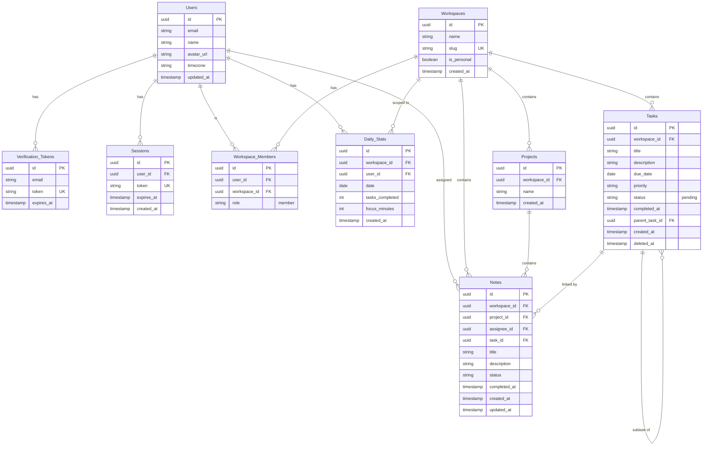

# Productivity App – Corrected ERD

Single **Daily_Stats** table, **Notes.task_id** (link to task), and unique `(workspace_id, user_id, date)` for daily stats.

## Entity-Relationship Diagram

## Corrections applied

| Item | Change |
|------|--------|
| **Daily_Stats** | Single table; one row per (workspace, user, date). Unique on `(workspace_id, user_id, date)`. |
| **Notes → Task** | `parent_task_id` renamed to `task_id` (note linked to one task). |
| **Diagram** | No duplicate entities; relationships match FKs above. |

## Unique / constraints

- **Verification_Tokens**: `token` unique  
- **Sessions**: `token` unique  
- **Workspaces**: `slug` unique  
- **Daily_Stats**: unique `(workspace_id, user_id, date)`

Render this in [Mermaid Live](https://mermaid.live), VS Code (Mermaid extension), or open `productivity-app-erd.html` and use **Print → Save as PDF**.
